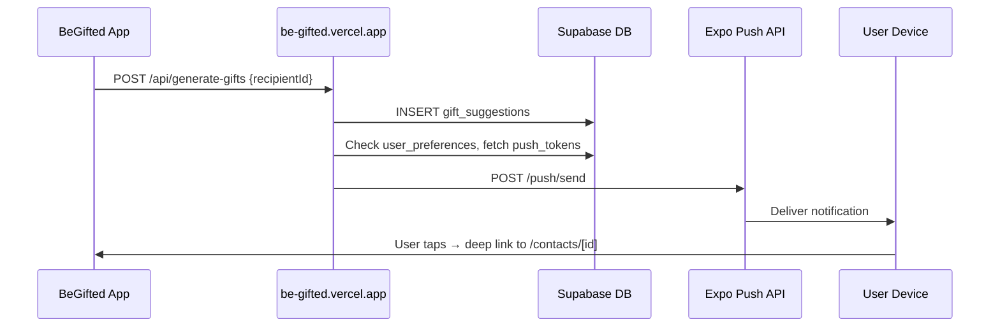

# Gift-Generated Push Notifications Plan (Revised)

## Overview

Push notifications alert users when gift suggestions have been generated for one of their recipients. The backend (`be-gifted`) sends notifications directly via the Expo Push API after successful gift generation — no database webhooks, Edge Functions, or deduplication tables needed.

---

## Current Architecture Summary

- **Gift generation flow**: App calls `https://be-gifted.vercel.app/api/generate-gifts` with `recipientId`. The backend generates AI suggestions, stores them in Supabase, and sends a push notification directly.
- **Data model**: `recipients` (user_id, id, name...) → `gift_suggestions` (recipient_id, ...). User is reachable via `recipients.user_id`.
- **Notification preferences**: `user_preferences` table has `push_notifications_enabled` (checked server-side before sending).
- **Push token storage**: `user_push_tokens` table stores Expo push tokens per user/device.

---

## Architecture



---

## Phase 1: Database (Push Token Storage)

### `user_push_tokens` table

Migration: `be-gifted/supabase/migrations/009_create_user_push_tokens.sql`

| Column | Type | Notes |
|--------|------|-------|
| id | UUID | Primary key |
| user_id | UUID | FK to auth.users, ON DELETE CASCADE |
| token | TEXT | Expo push token, UNIQUE |
| platform | TEXT | `ios` or `android` |
| created_at | TIMESTAMPTZ | Default NOW() |
| updated_at | TIMESTAMPTZ | Default NOW() |

RLS: Users can manage their own tokens.

No deduplication table is needed — the backend calls the notification service once per generation, not per row.

---

## Phase 2: Backend Service (be-gifted)

### Push notification service

`be-gifted/lib/services/push-notifications.ts`

- `sendGiftReadyNotification(userId, recipientName, recipientId)` — fire-and-forget
- Checks `user_preferences.push_notifications_enabled` (defaults true if no row)
- Fetches all tokens from `user_push_tokens` for the user
- POSTs to Expo Push API
- Handles `DeviceNotRegistered` by deleting invalid tokens
- Never throws — logs errors only

### Integration

- **Manual generation** (`app/api/generate-gifts/route.ts`): called after successful gift generation, guarded by `result.status === "ok"`
- **Cron generation** (`app/api/cron/generate-gifts/route.ts`): called per recipient after successful generation, guarded by `status === "success"`

Both wrapped in try/catch to ensure notification failure never affects the response.

---

## Phase 3: Client — expo-notifications and Token Registration

### Dependencies

```bash
npx expo install expo-notifications expo-device expo-constants
```

### Config

`expo-notifications` added to `plugins` array in `app.json`.

### Push registration module

`lib/push-notifications.ts`:

- `registerForPushNotifications(userId)`:
  - Checks `Device.isDevice` (skips on simulator)
  - Requests permissions via `Notifications.requestPermissionsAsync()`
  - Gets token via `Notifications.getExpoPushTokenAsync({ projectId })`
  - Upserts into `user_push_tokens` (token, platform, user_id)
- `unregisterPushToken()`:
  - Gets current token, deletes from `user_push_tokens`
  - Called on sign-out

### Notification handler hook

`hooks/use-push-notifications.ts`:

- `Notifications.setNotificationHandler` — show banner, play sound, set badge
- Android notification channel (`gift-suggestions`, high importance)
- `addNotificationResponseReceivedListener` → reads `data.recipientId`, navigates to `/contacts/[id]`
- Registers for push when user authenticates
- Unregisters on sign-out
- Clears badge count when app foregrounds

### Layout integration

`usePushNotifications()` called in `app/_layout.tsx` `RootLayout`.

---

## Phase 4: Settings UX

The existing `app/(tabs)/settings/notifications.tsx` toggle controls `push_notifications_enabled`. Update copy to:

- "Receive push notifications on your device when gift ideas are ready."

The backend checks this preference server-side before sending.

---

## Phase 5: EAS and Credentials

Push requires:

- **iOS**: APNs key configured via `eas credentials` and linked to the app.
- **Android**: FCM v1 credentials (Firebase) uploaded to EAS.
- **Build**: Use `eas build` for development and production; push does not work in Expo Go on Android from SDK 53+.

---

## Verification

1. **Backend**: Insert a test push token into `user_push_tokens`, then call `POST /api/generate-gifts`. Check Vercel function logs for Expo Push API request.
2. **Native app**: Build a dev client with `eas build --profile development`. Log in, verify token appears in `user_push_tokens`. Trigger gift generation and confirm notification arrives on device.
3. **Deep link**: Tap notification and verify navigation to recipient screen.
4. **Logout**: Sign out, verify token is deleted from `user_push_tokens`.
5. **Settings**: Toggle `push_notifications_enabled` off, trigger generation, verify no notification is sent.

---

## Edge Cases

- **Invalid tokens**: Backend handles `DeviceNotRegistered` by deleting tokens automatically.
- **Multiple devices**: All tokens for a user receive notifications.
- **No tokens**: Backend silently skips (logs only).
- **Simulator**: Registration is skipped via `Device.isDevice` check.
- **Permission denied**: Registration exits early; no token stored.
