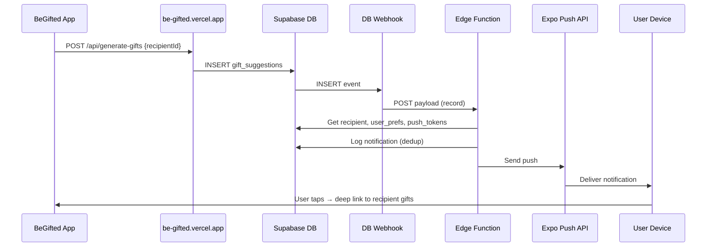

# Gift-Generated Push Notifications Plan

## Overview

Implement push notifications to alert users when gift suggestions have been generated for one of their recipients. The solution uses Supabase Database Webhooks to trigger an Edge Function when gift_suggestions rows are inserted, which sends notifications via the Expo Push API. The app will register for push, store tokens, and handle notification taps with deep linking.

---

## Current Architecture Summary

- **Gift generation flow**: App calls `https://be-gifted.vercel.app/api/generate-gifts` with `recipientId` (fire-and-forget). The external backend fetches the recipient, generates AI suggestions, and writes rows to Supabase `gift_suggestions`.
- **Data model**: `recipients` (user_id, id, name...) → `gift_suggestions` (recipient_id, ...). User is reachable via `recipients.user_id`.
- **Existing notification infrastructure**: [app/(tabs)/settings/notifications.tsx](app/(tabs)/settings/notifications.tsx) and [migrations/001_add_notification_preferences.sql](migrations/001_add_notification_preferences.sql) already define `user_preferences` with `push_notifications_enabled` and timezone.
- **No push implementation yet**: No expo-notifications, no push token storage, no delivery pipeline.

---

## Architecture



---

## Phase 1: Foundation (Database and Push Token Storage)

### 1.1 Push token storage

Create a migration for a `user_push_tokens` table:

- `id` (uuid, primary key)
- `user_id` (uuid, FK to auth.users)
- `token` (text, unique) — Expo push token, e.g. `ExponentPushToken[xxx]`
- `platform` (text) — `ios` or `android`
- `created_at`, `updated_at`
- RLS: users can only insert/update/delete their own tokens

Users may have multiple devices; the Edge Function will send to all tokens for the user.

### 1.2 Deduplication / notification log

To avoid multiple notifications for the same gift generation (one generation can create several `gift_suggestions` rows), add a simple log:

- `gift_generation_notifications` table: `recipient_id`, `notified_at`, `user_id`
- Or: in-memory/Redis cooldown in the Edge Function (simpler but less durable)

Recommended: **DB-backed cooldown** — before sending, check if we notified for this `recipient_id` within the last N minutes (e.g. 10). If yes, skip.

---

## Phase 2: Supabase Edge Function (send notification)

### 2.1 New Edge Function: `send-gift-generated-notification`

**Trigger**: Supabase Database Webhook on `gift_suggestions` INSERT.

**Payload**: Webhook sends `{ type: 'INSERT', table: 'gift_suggestions', record: { recipient_id, ... } }`.

**Logic**:

1. Extract `recipient_id` from the payload.
2. Query `recipients` for `user_id` and `name` where `id = recipient_id`.
3. If no recipient, exit.
4. Query `user_preferences` for `push_notifications_enabled` for that `user_id`. If disabled, exit.
5. Check cooldown: if we already notified this recipient in the last 10 minutes, exit.
6. Query `user_push_tokens` for all tokens for this `user_id`.
7. If no tokens, exit (optionally log).
8. Build Expo push payload:
   - `title`: "Gift ideas ready"
   - `body`: "New gift suggestions for {recipientName}!"
   - `data`: `{ recipientId, type: 'gift_generated' }` (for deep linking)
9. POST to `https://exp.host/--/api/v2/push/send` with the message(s).
10. On success, insert into `gift_generation_notifications` (recipient_id, user_id, notified_at) to enforce cooldown.

**Dependencies**: Use `fetch` or a Deno-compatible HTTP client; no need for expo-server-sdk in Deno.

**Error handling**: Log errors; do not retry webhook. Optionally handle `DeviceNotRegistered` by deleting or flagging invalid tokens when processing receipts.

---

## Phase 3: Database Webhook

Create a Supabase Database Webhook (via Dashboard or SQL):

- **Events**: INSERT
- **Table**: `gift_suggestions`
- **URL**: `https://<project-ref>.supabase.co/functions/v1/send-gift-generated-notification`

If using SQL with `pg_net`, the trigger would call `supabase_functions.http_request` with the Edge Function URL. For production, use the project's real Supabase URL.

---

## Phase 4: Client — expo-notifications and token registration

### 4.1 Install dependencies

```bash
npx expo install expo-notifications expo-device expo-constants
```

### 4.2 Config

Add `expo-notifications` to the `plugins` array in [app.json](app.json).

### 4.3 Push registration

Create a `lib/push-notifications.ts` (or `hooks/use-push-registration.ts`):

- Request permission via `Notifications.requestPermissionsAsync()`.
- Get `projectId` from `Constants.expoConfig?.extra?.eas?.projectId` (already set in [app.json](app.json): `16c0ca90-545c-4ff3-be91-227aae28dbe5`).
- Call `Notifications.getExpoPushTokenAsync({ projectId })` and get the token string.
- Upsert into `user_push_tokens` (user_id, token, platform) when the user is logged in.

Invoke this:

- On app launch when the user is authenticated.
- On login (e.g. in auth state listener).

Ensure registration runs only on a physical device (`expo-device`); skip or no-op on simulators.

### 4.4 Notification handler

Configure `Notifications.setNotificationHandler` in the root layout (e.g. [app/_layout.tsx](app/_layout.tsx)):

- `shouldPlaySound`, `shouldSetBadge`, `shouldShowBanner`, `shouldShowList`: true.

Add listeners:

- `addNotificationReceivedListener` — optional; can show in-app UI.
- `addNotificationResponseReceivedListener` — handle taps and route using `response.notification.request.content.data` (e.g. `recipientId`).

### 4.5 Deep linking on tap

When the user taps the notification:

- Read `data.recipientId` (and optionally `data.type === 'gift_generated'`).
- Navigate to the recipient's gift tab, e.g. `/contacts/[id]` with the Gifts tab selected (if your router supports tab params).

---

## Phase 5: Settings UX (optional refinement)

The existing [app/(tabs)/settings/notifications.tsx](app/(tabs)/settings/notifications.tsx) toggle "Push Notifications" currently says "Receive notifications directly in your browser." Update copy to reflect mobile push, e.g.:

- "Receive push notifications on your device (e.g. when gift ideas are ready)."

Optionally add a dedicated toggle for "Gift suggestions ready" under `user_preferences` if you want finer control. For Phase 1, `push_notifications_enabled` is sufficient.

---

## Phase 6: EAS and credentials

Push requires:

- **Android**: FCM v1 credentials (Firebase) uploaded to EAS (see [Expo FCM credentials](https://docs.expo.dev/push-notifications/fcm-credentials)).
- **iOS**: APNs key configured via `eas credentials` and linked to the app.
- **Build**: Use `eas build` for development and production; push does not work in Expo Go on Android from SDK 53+.

---

## Implementation Order

| Step | Task | Files / Location |
| --- | --- | --- |
| 1 | Create `user_push_tokens` migration | `migrations/002_user_push_tokens.sql` |
| 2 | Create `gift_generation_notifications` (or equivalent) for cooldown | Same migration or separate |
| 3 | Implement Edge Function `send-gift-generated-notification` | `supabase/functions/send-gift-generated-notification/index.ts` |
| 4 | Create Database Webhook for `gift_suggestions` INSERT | Supabase Dashboard or migration |
| 5 | Add expo-notifications + push registration | `lib/push-notifications.ts`, `app/_layout.tsx` |
| 6 | Handle notification tap and deep link | `app/_layout.tsx` or a provider |
| 7 | Update settings copy | `app/(tabs)/settings/notifications.tsx` |
| 8 | Configure EAS credentials (FCM, APNs) | `eas.json`, EAS Dashboard |

---

## Edge cases and future work

- **Multiple inserts per generation**: Cooldown prevents multiple notifications for the same recipient in a short window.
- **Invalid tokens**: Handle `DeviceNotRegistered` in push receipts and remove tokens from `user_push_tokens`.
- **be-gifted backend**: If it moves or changes how it writes to `gift_suggestions`, the webhook will still fire as long as inserts happen in Supabase.
- **Email notifications**: `email_notifications_enabled` exists; add an email path in the Edge Function or a separate worker later.

---

## Out of scope for this plan

- In-app notification center.
- Occasion reminder notifications (schema exists; implementation is separate).
- Web push (current UI copy suggests browser; this plan focuses on mobile).
